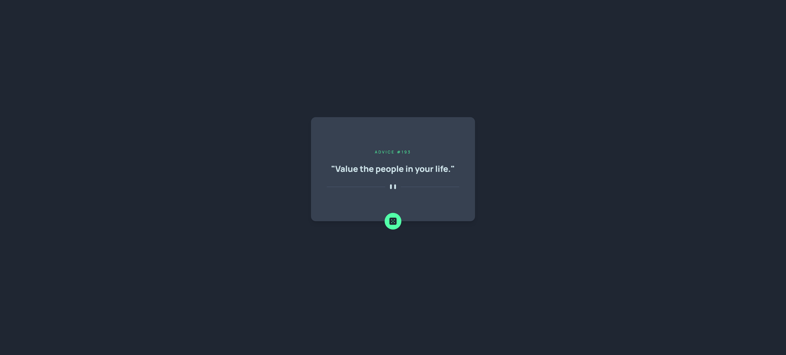
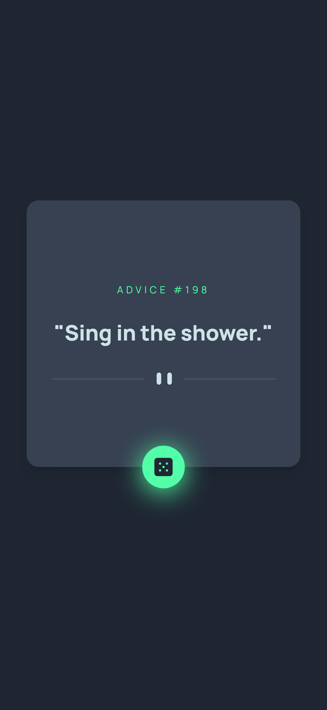

# Frontend Mentor - Advice generator app solution

This is a solution to
the [Advice generator app challenge on Frontend Mentor](https://www.frontendmentor.io/challenges/advice-generator-app-QdUG-13db).
Frontend Mentor challenges help you improve your coding skills by building realistic projects.

## Table of contents

- [Overview](#overview)
    - [The challenge](#the-challenge)
    - [Screenshot](#screenshot)
    - [Links](#links)
- [My process](#my-process)
    - [Built with](#built-with)
    - [Continued development](#continued-development)
    - [Useful resources](#useful-resources)
- [Author](#author)

## Overview

### The challenge

Users should be able to:

- View the optimal layout for the app depending on their device's screen size
- See hover states for all interactive elements on the page
- Generate a new piece of advice by clicking the dice icon

### Screenshot

Below are screenshots of the webpage in both desktop and mobile view:

### Links

- Solution URL: [Solution URL on GitHub](https://github.com/LorryAfriyie/advice-generator-app)
- Live Site URL: [Live website URL](https://lorryafriyie.github.io/advice-generator-app)

## My process

### Built with

- CSS custom properties
- Flexbox
- CSS Grid
- Mobile-first workflow
- [React](https://reactjs.org/) - JS library
- [Vite.js](https://vitejs.dev/) - Frontend Tooling
- [TailwindCSS](https://tailwindcss.com/) - CSS Framework

### Continued development

- Learn how to utilize TailwindCSS.

### Useful resources

- [Tailwind center div with CSS Grid](https://daily-dev-tips.com/posts/center-elements-with-tailwind-css/) - This
  article explains how to center a div in the center of the page using TailwindCSS.

- [Working with Props and Types of Props](https://www.kindacode.com/article/react-typescript-working-with-props-and-types-of-props/) -
  This article explains the usage of props from a TypeScript context.

- [Overlapping elements](https://www.youtube.com/watch?v=qyQm8YeGMJQ) -
  This tutorial teaches how to overlap html elements in different methods.

- [Glow effect on hover](https://superdevresources.com/css-button-glow-effect/) -
  This website explains how to create a glow on hover effect on a button.

- [Remove caching](https://www.answeroverflow.com/m/1166035177504514149) - This community post discusses how to remove
  caching to prevent advice generating slowdowns.

## Author

- Frontend Mentor - [@LorryAfriyie](https://www.frontendmentor.io/profile/LorryAfriyie)
